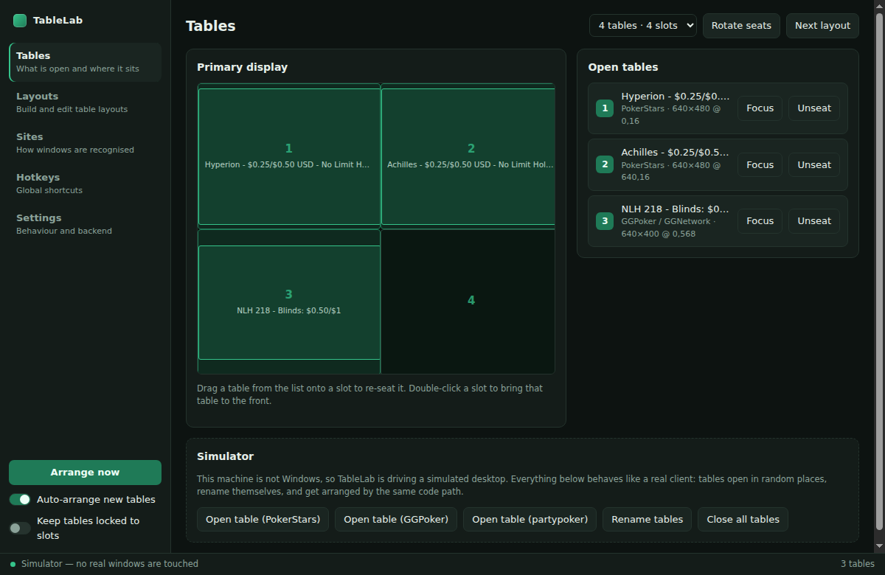
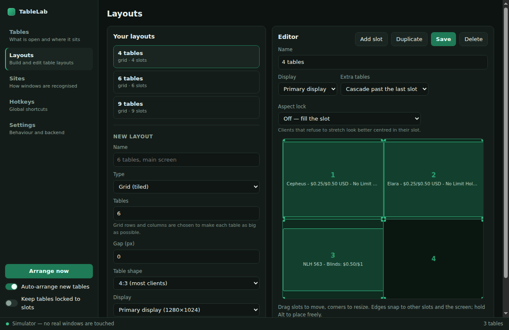
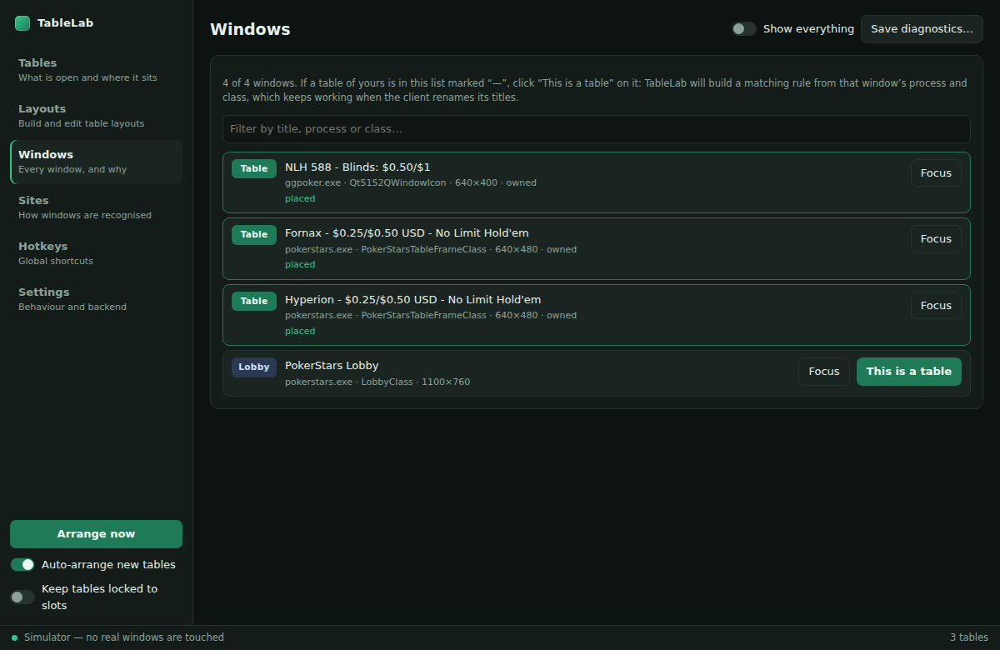

# TableLab — a poker table manager

Finds your poker client's table windows and arranges them into a layout you
designed, the way Jurojin Poker or Table Ninja do. New tables land in the next
free slot the moment they open; closed tables free their seat; global hotkeys
re-arrange, rotate and switch tables without leaving the felt.

It manages *windows*. It does not read cards, calculate odds, act for you, or
inject anything into the poker client — see [Scope](#scope-and-limits).



## Running it

```bash
npm install
npm start          # real windows on Windows, simulator elsewhere
npm run dev        # force the simulator
npm test           # 51 unit tests, no Windows required
npm run dist:win   # build a Windows installer + portable exe
```

Node 20+ is required to build. The Windows build needs no compiler: window
management goes through [koffi](https://koffi.dev), which ships prebuilt
binaries as one package per platform.

### Getting a downloadable .exe

**From CI (recommended).** Every push that touches `desktop/` runs
[the Windows workflow](../.github/workflows/tablelab-windows.yml) on a
`windows-latest` runner: it typechecks, runs the tests against Windows Node, and
builds both artifacts. Download them from the run's *Artifacts* section
(`TableLab-windows-x64`) — `TableLab-Setup-<version>.exe` to install, or
`TableLab-<version>-portable.exe` to run with no installation.

**Locally on Windows.** `npm run dist:win` produces the same two files in
`release/`.

**Locally on Linux or macOS.** Cross-building mostly works —
`npm run prepare:win-native` fetches the Windows koffi binary that npm refuses
to install on a foreign platform — but two steps shell out to Windows
executables and therefore need wine:

- writing the icon and version resources into the exe (`rcedit`), and
- generating the NSIS uninstaller, which is built by *running* the installer.

Without wine, add `-c.win.signAndEditExecutable=false` and build the `portable`
target only; the result runs fine but carries the stock Electron file icon.
This is why the downloadable builds come from the Windows runner.

## How it works

```
scan (every 750ms)      classify                 assign                  place
OS window list  ──▶  site profiles decide  ──▶  sticky slot     ──▶  move/resize
                     table / lobby / other      assignment            the window
```

**Scanning.** `EnumWindows` gives every top-level window; child, tool, cloaked
and owned windows are dropped before anything else looks at them.

**Classifying.** Each window is run past the site profiles in `Sites`. A profile
matches on process name, window class and title regexes. The window class is
preferred where a client has a stable one (`PokerStarsTableFrameClass`), because
titles get rewritten constantly.

**Table identity.** Clients rename table windows on nearly every hand — stack
sizes, blind levels, "action on you" markers. A table is keyed on the part that
does not move, so a rename never looks like a new table and never costs a seat.

**Assignment is sticky.** A table that owns a slot keeps it. New tables take the
lowest free slot (or the nearest one to where they opened, your choice). A table
that closes releases its seat, and gets it back if it reappears within two
minutes — a disconnect and reconnect should not reshuffle your screen.

**Placing.** Since Windows 10, `GetWindowRect` includes ~7px of invisible resize
border. TableLab asks DWM for the real frame and compensates, so tiled tables
sit edge to edge instead of leaving gaps. With an aspect lock on, a table is
scaled to the largest size its own aspect ratio allows inside the slot and
centred there — clients that refuse to stretch still line up.

By default a table is placed once, when it appears. Drag one aside and it stays
where you put it. Turn on **Keep tables locked to slots** if you want it snapped
back on every scan.

## Layouts

Grid, stack and cascade layouts are generated for you; the grid split is chosen
to make each table as large as possible for its aspect ratio, which is not
always the squarest grid — four 4:3 tables on an ultrawide are bigger in one row
than in a 2x2.

Any generated layout can then be edited by hand: drag slots to move, corners to
resize, edges snap to the other slots and to the screen (hold <kbd>Alt</kbd> to
place freely). A slot can be reserved for one site, so — for example — Zoom
tables always take the same seat. Extra tables beyond the last slot can cascade,
stack, or be left alone.



## Hotkeys

| Default | Action |
| --- | --- |
| <kbd>Alt</kbd>+<kbd>A</kbd> | Arrange every table now |
| <kbd>Alt</kbd>+<kbd>L</kbd> | Next layout |
| <kbd>Alt</kbd>+<kbd>←</kbd> / <kbd>→</kbd> | Focus previous / next table in slot order |
| <kbd>Alt</kbd>+<kbd>R</kbd> | Rotate every table one seat forward |
| <kbd>Alt</kbd>+<kbd>S</kbd> | Toggle auto-arrange |
| <kbd>Alt</kbd>+<kbd>T</kbd> | Show TableLab |

All rebindable. A combination another program already owns is reported in the
Hotkeys tab rather than failing silently.

Bringing a table to the front uses the `AttachThreadInput` route, because
Windows refuses `SetForegroundWindow` from a background process — this is what
makes hotkey table-switching work while a client has focus.

## Your client is not recognised

Open the **Windows** tab. It lists *every* top-level window on the desktop with
its title, process, window class, size and flags, plus what TableLab decided
about it and — when it decided nothing — why. Find one of your table windows,
click **This is a table**, and a matching rule is built from that window's
process and class.

That is the reliable path. Predicting a client's window titles from the outside
does not work: they differ by skin, by client version and by game type, and
they get rewritten every hand. Keying on process and class does not.



For finer control, **Sites** holds the same rules as editable regexes. The
built-in profiles for PokerStars, GGPoker, CoinPoker, partypoker, 888, Winamax
and the WPN skins are starting points, not guarantees.

## When a table will not move

Three things go wrong on real clients, and each one now says so rather than
failing quietly:

- **"would not move"** — the client accepted the request and ignored it. Almost
  always it is running as administrator while TableLab is not; Windows will not
  let a normal process reach into an elevated one's windows. Right-click
  TableLab → *Run as administrator*.
- **"positioned (client keeps its own size)"** — a fixed-size client. TableLab
  detects this on the first move, stops asking for a resize it will never
  perform, and centres the table in its slot instead.
- **Nothing detected at all** — the banner names any process on screen that
  looks like a poker client, and the Windows tab shows what it actually is.

**Save diagnostics…** in the Windows tab writes a JSON dump — every window,
every profile, the displays, the active layout and the placement results — and
opens the folder. That file is what to attach to a bug report.

## Developing without Windows

`npm run dev` runs a simulated desktop: tables open in random places, rename
themselves like real clients, and are arranged through exactly the same code
path. The Tables tab grows a Simulator panel to open and close them. This is
also what the test suite drives, so the manager loop is covered on any OS.

```
src/core/      pure logic — geometry, layouts, matching, assignment (all tested)
src/main/      Electron main: config, scan loop, hotkeys, tray
src/main/platform/  win32 (koffi → user32/dwmapi) and mock backends
src/renderer/  the UI — no framework, just the DOM
```

Config lives in `%APPDATA%/TableLab/config.json` (`~/.config/TableLab` on
Linux). It is hand-editable, and a broken file falls back to defaults instead of
a crash loop.

## Scope and limits

- **Windows only for real window management.** The macOS and Linux equivalents
  (Accessibility API, X11/wmctrl) are not implemented; on those systems the app
  runs the simulator and says so in the status bar.
- **No HUD, no odds, no automated actions.** TableLab moves windows. It does not
  read the table, click buttons, or send input to the client.
- **Mixed-DPI setups** are handled by working in physical pixels from
  `EnumDisplayMonitors` rather than trusting a scale factor.
- Poker sites set their own rules about which tools are allowed. A window
  manager is normally fine, but the rules are the site's, not this README's —
  check yours before running anything alongside real-money play.
